

<h1>On-premises Active Directory Deployed in the Cloud (Azure)</h1>
This tutorial outlines the implementation of on-premises Active Directory within Azure Virtual Machines. 

<!--
<h2>Video Demonstration</h2>

- ### [YouTube: How to Deploy on-premises Active Directory within Azure Compute](https://www.youtube.com)
-->

<h2>Environments and Technologies Used</h2>

- Microsoft Azure (Virtual Machines/Compute)
- Remote Desktop
- Active Directory Domain Services
- PowerShell

<h2>Operating Systems Used </h2>

- Windows Server 2022
- Windows 10 Pro (22H2)

<h2>High-Level Deployment and Configuration Steps</h2>

1. Create two *virtual machines* for the **client** and **domain controller**
2. Configure connectivity between the virtual machines
3. Install Active Directory on the domain controller
4. Create users in Active Directory
5. Join the client to the Active Directory domain
6. Allow remote desktop for normal users on the client VM
7. Create users with PowerShell

<h2>Deployment and Configuration Steps</h2>
<h3>Step 1 - Creating the virtual machines</h3>

From the Azure portal, we will create two virtual machines. One of these VMs will be the domain controller, which will be running Windows Server 2022. The other VM will be a client that will be used for testing AD, and will run Windows 10 Pro. The virtual machines will be created as follows:

  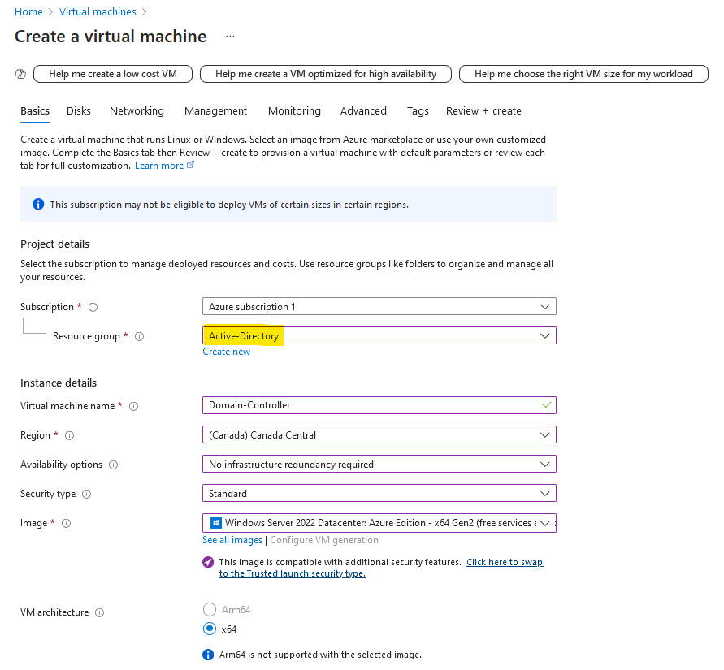
  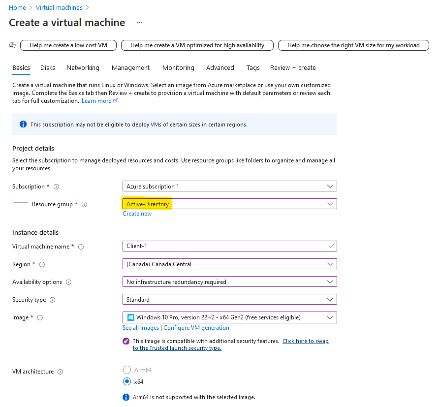

Note that when creating the client VM that you put it under the same virtual network as the domain controller!

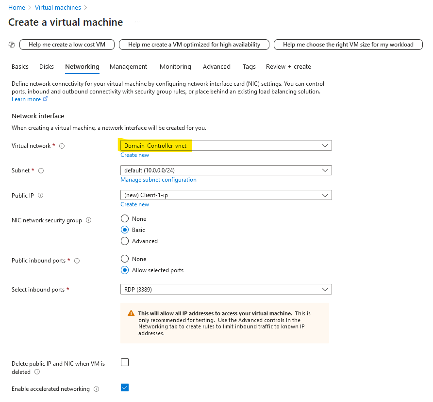

<h3>Step 2 - Configuring Connectivity Between Client and Domain Controller</h3>

If we remote connect into the client and try pinging the domain controller, we'll notice we are unable to reach the domain controller.

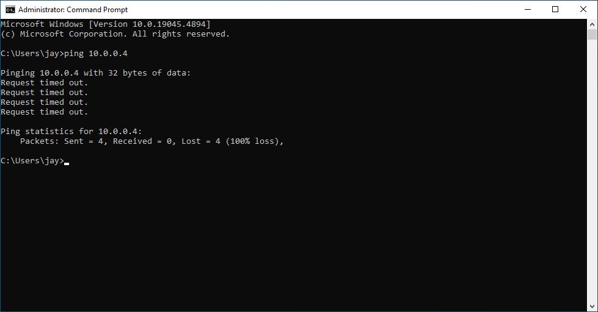

This is because the domain controller firewall is blocking ICMP traffic. We can log in to the domain controller and simply enable ICMPv4 in the firewall settings. Just navigate to `Control Panel > Windows Defender Firewall > Advanced Settings > Inbound Rules`, sort by *protocol*, and enable these two rules for ICMPv4.

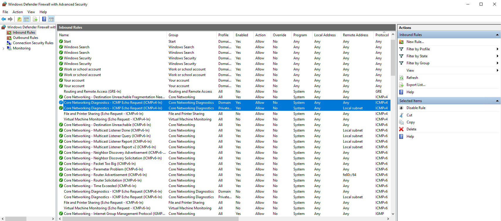

Now, if we go back to our client and ping the domain controller, we should see that the ping succeeds.

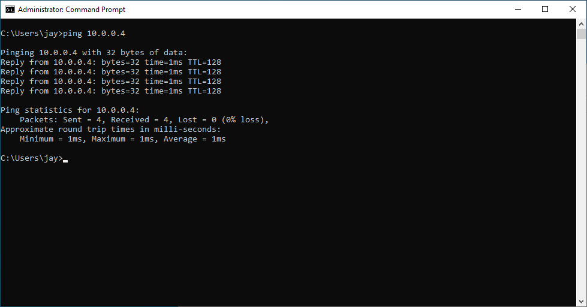

<h3>Step 3 - Install Active Directory</h3>

In the domain controller, open server manager and click on `Add roles and features`

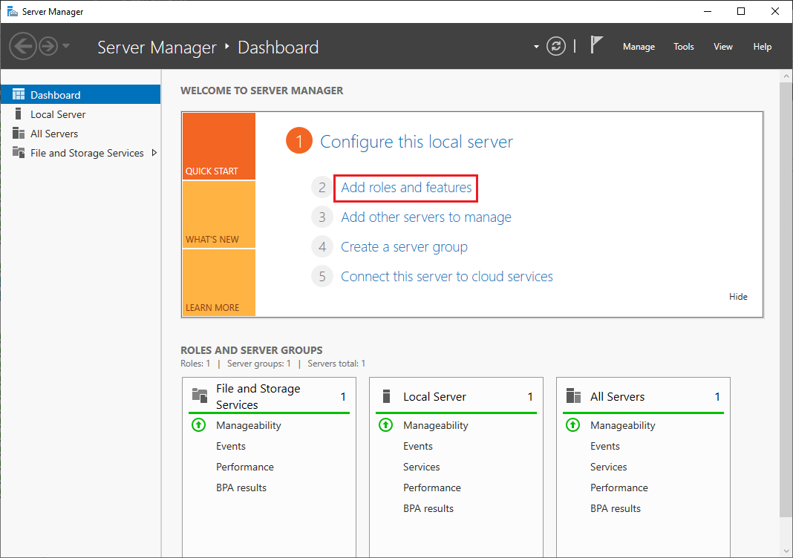

Choose the following options in the setup wizard

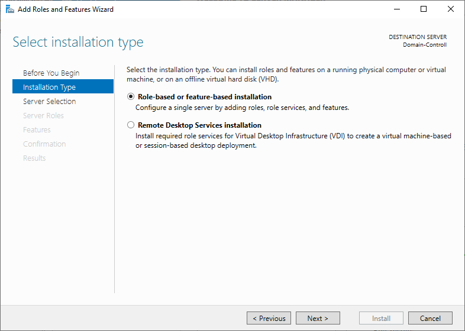
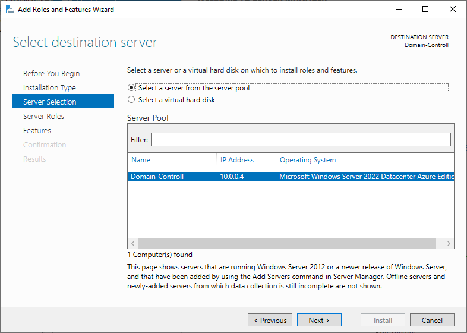

In the server roles step, select `Active Directory Domain Services`:

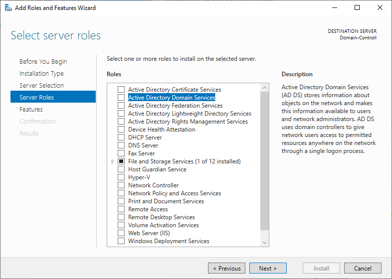

After selecting this, a new windows will pop up. Select `Add Features` and hit next until you reach the confirmation step of the wizard.

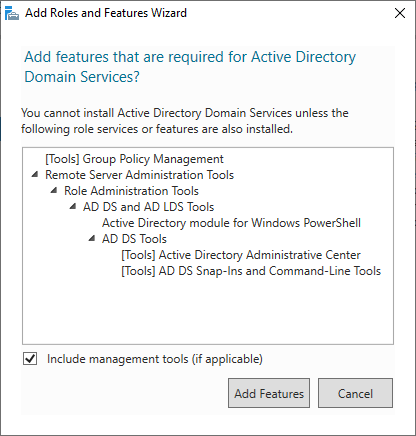

On the confirmation step, hit install:

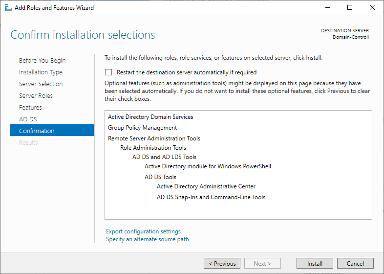

Once the installer has finished, we will need to promote the VM to an actual domain controller:

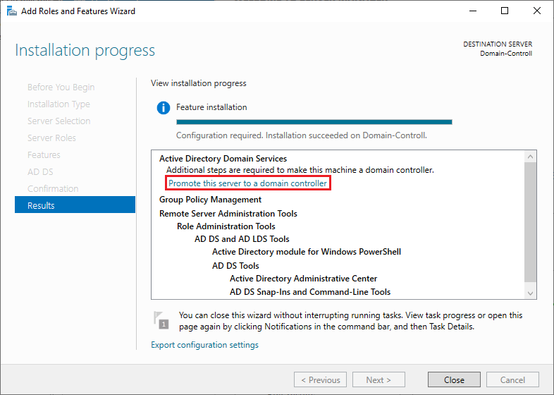

A new wizard will open for setting up Actice Directory Domain Services. We will create a new forest, which we'll call `mydomain.com`:

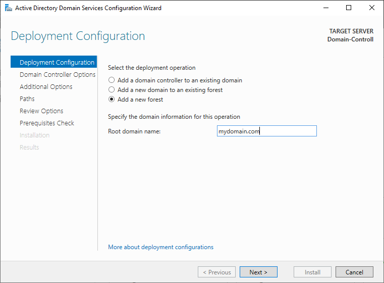

Set the options as follows and choose a strong a password for the DSRM:

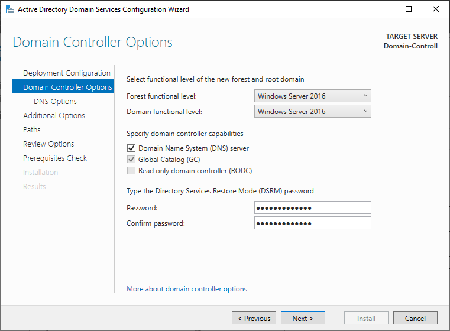

We will not create a DNS delegation, so uncheck this option:

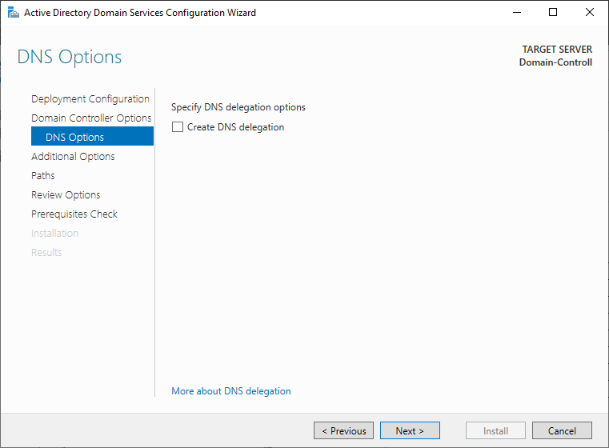

Continue through the wizard until the `Prerequisites check` and click install:

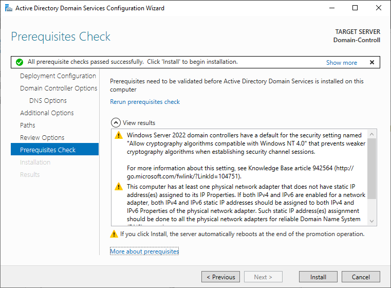

After the installation wizard is finished, the machine will restart.

<h3>Step 4 - Creating Users in Active Directory</h3>

First search and open `Active Directory Users and Computers`:

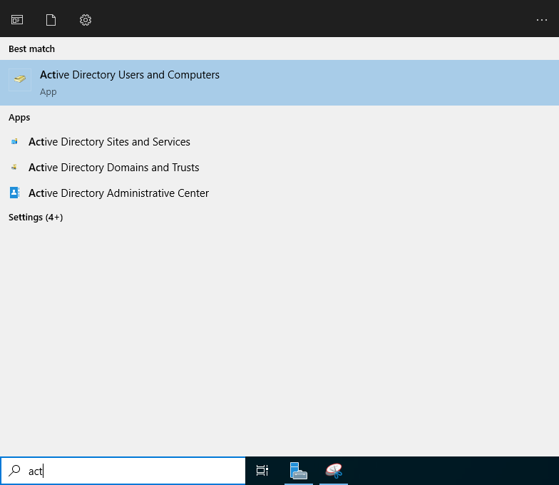

Navigate to `mydomain.com`, which is our root domain name:

Here, we can organize users into `Organizational Units (OU)` . These can be thought of as folders/containers that hold users, groups, and computers. In our organization, we create OUs for two different types of users: **Employees** and **Admins**. To create these, simply right click on the domain name and go to `New -> Organizational Unit`:

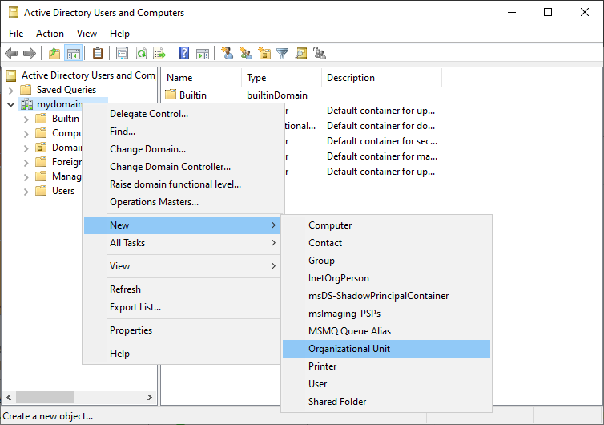

We will create organizational units named `_EMPLOYEES` and `_ADMINS`. The initial underscore is a convention used to indicate that these were organizational units manually created rather than being a default created OU.

  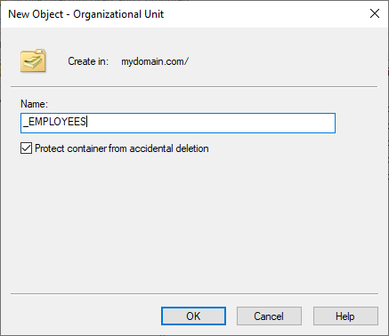
  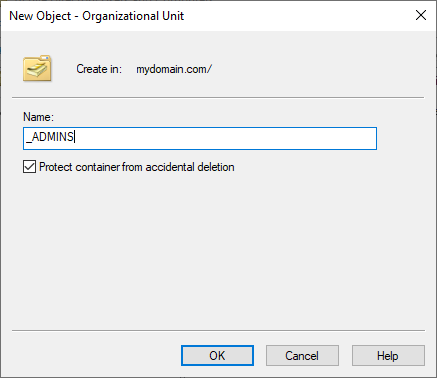

These OUs should now appear under our domain name.
