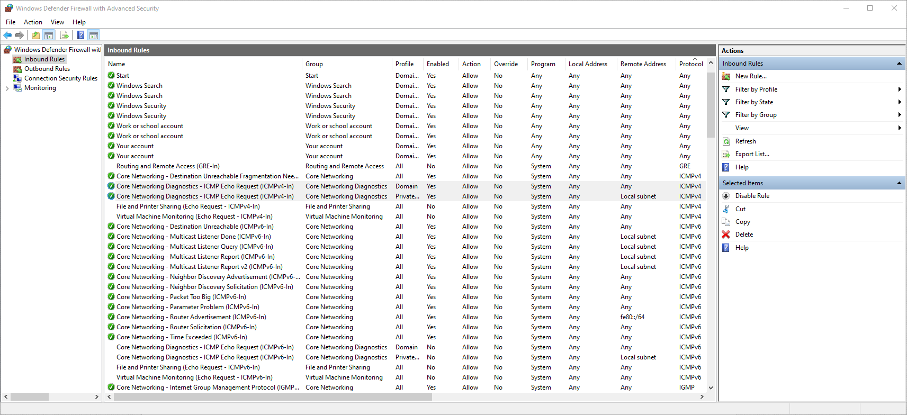

<h1>On-premises Active Directory Deployed in the Cloud (Azure)</h1>
This tutorial outlines the implementation of on-premises Active Directory within Azure Virtual Machines. 

<!--
<h2>Video Demonstration</h2>

- ### [YouTube: How to Deploy on-premises Active Directory within Azure Compute](https://www.youtube.com)
-->

<h2>Environments and Technologies Used</h2>

- Microsoft Azure (Virtual Machines/Compute)
- Remote Desktop
- Active Directory Domain Services
- PowerShell

<h2>Operating Systems Used </h2>

- Windows Server 2022
- Windows 10 Pro (22H2)

<h2>High-Level Deployment and Configuration Steps</h2>

1. Create two *virtual machines* for the **client** and **domain controller**
2. Configure connectivity between the virtual machines
3. Install Active Directory on the domain controller
4. Create users in Active Directory
5. Join the client to the Active Directory domain
6. Allow remote desktop for normal users on the client VM
7. Create users with PowerShell

<h2>Deployment and Configuration Steps</h2>
<h3>Step 1 - Creating the virtual machines</h3>

From the Azure portal, we will create two virtual machines. One of these VMs will be the domain controller, which will be running Windows Server 2022. The other VM will be a client that will be used for testing AD, and will run Windows 10 Pro. The virtual machines will be created as follows:

  
  

Note that when creating the client VM that you put it under the same virtual network as the domain controller!

<h3>Step 2 - Configuring Connectivity Between Client and Domain Controller</h3>

If we remote connect into the client and try pinging the domain controller, we'll notice we are unable to reach the domain controller.

This is because the domain controller firewall is blocking ICMP traffic. We can log in to the domain controller and simply enable ICMPv4 in the firewall settings. Just navigate to `Control Panel > Windows Defender Firewall > Advanced Settings > Inbound Rules`, sort by *protocol*, and enable these two rules for ICMPv4.

Now, if we go back to our client and ping the domain controller, we should see that the ping succeeds.

<h3>Step 3 - Install Active Directory</h3>

The a